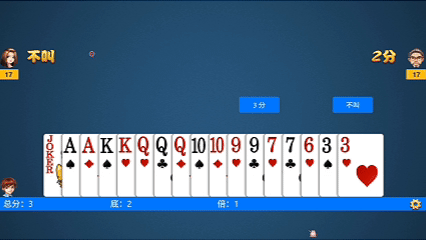

# 桌灵 DeskSprite

一个住在你屏幕里的 AI 小精灵：按住说话、随时打字，它能看到你的屏幕、圈出正在讨论的东西，还会在你不注意的时候冒出来吐槽两句。启动时它就在屏幕上散步，圈圈就是它的名片。



基于 Python + Tkinter，毛玻璃（Win32 Acrylic）界面，语音走 Whisper 识别 + edge-tts / DashScope 合成，对话走 OpenAI 兼容接口（可接任意供应商）。

## 功能特性

- **语音对话**：按住快捷键说话，松开发送（自动打断 AI 说话，barge-in）
- **打字聊天**：呼出输入框打字，Enter 发送
- **屏幕视觉**：对话时发送屏幕截图，AI 结合画面回答
- **屏幕指示**：AI 用 `[[指示:圈:50,30,12]]` 这类标记内联指出位置，程序在屏幕上实时画圈圈、框、箭头（最多 10 个，按语音节奏依次圈）
- **指示状态机**：红色指示会变形——录音时变方块脉冲、等待回复时转圈加载、空闲时散步游走
- **散步精灵**：启动就在屏幕上散步的红色小光标，闲时随机游走
- **说话气泡**：跟随指示的毛玻璃字幕气泡，逐句滚动（长句自动扩高看全），说完话才消失
- **飘屏弹幕**：可选开关（默认关），怀念旧版弹幕可打开，与气泡共存
- **随机吐槽**：每隔一段时间 AI 自己看一眼屏幕，主动开口（间隔可调）
- **毛玻璃设置窗口**：API / TTS / 通用 / 对话历史 / AI 人设 / 快捷键，全部可视化配置
- **自定义快捷键**：按住说话、聊天、设置、打断语音、框选截图——任意按键组合可录制
- **AI 人设可切换**：默认暖友 / 毒舌损友 / 自定义人设（保存即热切换，无需重启）

## 环境要求

- Windows 10 1809+（毛玻璃效果需要）
- Python 3.10+
- 一个 OpenAI 兼容的 LLM API（密钥）

## 快速开始

```bash
# 1. 克隆并安装依赖
git clone <repo-url>
cd DeskSprite
python -m venv .venv
.venv\Scripts\activate
pip install -r requirements.txt

# 2. 配置密钥
copy .env.example .env
# 编辑 .env，填入 GG_API_KEY（OpenAI 兼容接口密钥，GG_BASE_URL 可换成你自己的服务地址）

# 3. 运行
python main.py
```

> 语音识别使用 faster-whisper。默认模型 `small`（首次运行自动从 HuggingFace 下载，约 460MB）。
> 在设置窗口的「通用」页可改成 `base`/`medium` 或本地模型目录。GPU 用户把 Whisper 设备设为 `cuda`。

## 使用指南

| 操作 | 默认快捷键 | 说明 |
|---|---|---|
| 按住说话 | `V` | 按住录音，松开发送；AI 说话时按下可打断 |
| 聊天输入框 | `F2` | Enter 发送，Shift+Enter 换行，Esc 收起 |
| 设置窗口 | `F3` | 所有配置可视化 |
| 打断语音 | （未设置） | 可在设置里录制 |
| 框选截图 | （未设置） | 隐私模式（开发中） |

所有快捷键都可以在 设置 → 通用 里点「录制」重新绑定，支持任意按键组合（如 `Ctrl+Alt+V`）。

**AI 人设**：设置 → AI 人设，可选「默认暖友」「毒舌损友」，或自定义写一段人设文本。

## 项目结构

```
main.py                 入口：装配服务、启动 GUI 与后台线程
config.py               配置读取（.env + settings.json）
core/                   控制流（对话编排、随机吐槽、键盘监听、人设预设）
services/               LLM 客户端、Whisper 识别、TTS 合成
ui/                     Tkinter 界面（毛玻璃设置窗、聊天输入框、弹幕、屏幕画笔）
utils/                  快捷键解析、截图、持久化
```

架构约定：GUI 跑在 Tk 主线程；录音、LLM、TTS、吐槽、键盘监听都在后台线程，通过队列向 GUI 发指令，后台不直接碰 Tk。

## 隐私说明（重要）

- 程序会**定时或对话时截取你的屏幕**，连同对话内容一起发送给你配置的 LLM API（第三方服务）
- 随机吐槽默认每 30~300 秒截屏一次，可通过设置拉长间隔或未来版本关闭
- 对话历史保存在本地 `history.json`，密钥保存在 `.env`（均已被 `.gitignore` 忽略，不会提交）
- 建议使用可信任的 API 供应商，并留意自己屏幕上的敏感信息

## 常见问题

**语音识别模型下载很慢 / 失败**
设置 `WHISPER_MODEL_PATH` 为本地已下载的模型目录，或科学上网后重试。

**没有声音 / 语音合成失败**
默认使用 edge-tts（免费，无需密钥）。若使用 DashScope 后端，需在 `.env` 填写 `QWEN_API_KEY`。

**毛玻璃不生效**
需要 Windows 10 1809+ 且系统主题为正常桌面会话（远程桌面/部分精简系统无效果，会退回普通窗口）。

**快捷键没有反应**
检查是否有其他软件占用了相同组合；自己在设置里重新录制一个试试。

## License

[MIT](LICENSE)
